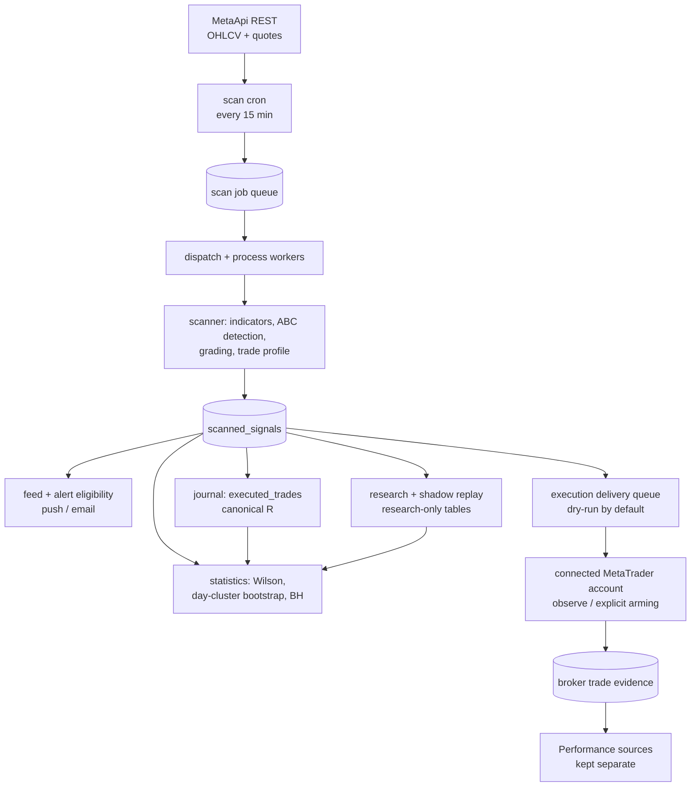

# P-Trades Hub

A quantitative FX market-scanning, trade-planning, risk-sizing, journaling,
statistical-analysis and assistant-access terminal.

P-Trades Hub is built around **selectivity, not trade frequency**. The scanner's
normal output is nothing. It examines a small, fixed instrument set on a fixed
cadence, rejects structures that fail its rules, and publishes only what
survives. An empty feed is a valid, expected result — not a failure and not a
sign that data is missing. Every number the terminal shows is either derived
from broker market data or explicitly labelled as user-entered, estimated, or
research-only. When an input is missing or stale, the app refuses to compute
rather than guessing.

It is analytical software. It does not manage money, guarantee returns, or give
financial advice.

- Production app: **https://getptrades.com**
- Documentation: [`docs/`](docs/README.md)

---

## 1. Current production scope

Everything below is derived from the implementation at HEAD.

| Area                 | Current behaviour                                                                                                                                                                                  | Source                                                                                      |
| -------------------- | -------------------------------------------------------------------------------------------------------------------------------------------------------------------------------------------------- | ------------------------------------------------------------------------------------------- |
| Instruments          | `XAUUSD`, `GBPAUD`, `EURUSD`                                                                                                                                                                       | `src/lib/scanner/types.ts` (`INSTRUMENTS`)                                                  |
| Timeframes           | `H4`, `H1`, `M15`                                                                                                                                                                                  | `src/lib/scanner/types.ts` (`TIMEFRAMES`)                                                   |
| Candle depth         | 300 / 300 / 200 bars                                                                                                                                                                               | `CANDLE_LIMITS`                                                                             |
| Scan cadence         | Every 15 minutes, cron-triggered, queue + worker fan-out                                                                                                                                           | `src/routes/api/public/cron/scan.ts`, `src/routes/api/public/worker/*`                      |
| Market data          | MetaApi REST only (no streaming sockets), hard per-request timeout, per-instrument health flags                                                                                                    | `src/lib/scanner/metaapi.server.ts`                                                         |
| Pattern              | ABC retracement structure with a Point-C liquidity test                                                                                                                                            | `src/lib/scanner/grading.ts`                                                                |
| Grades               | `A+`, `A`, `B`, `C`                                                                                                                                                                                | `Grade` in `src/lib/scanner/types.ts`                                                       |
| Confluence weighting | trend 35%, order block 25%, momentum 20%, volatility expansion 20%; R:R applied afterwards as a cap, not a fifth weight                                                                            | `CONFIDENCE_WEIGHTS`                                                                        |
| Signal lifecycle     | `active` → resolved or `expired`; active setups older than 24h are swept each cycle                                                                                                                | `SIGNAL_MAX_AGE_HOURS`                                                                      |
| Order time-in-force  | 30 minutes (two M15 candles) for an unfilled pending order                                                                                                                                         | `ORDER_TIF_MINUTES`                                                                         |
| Retention            | A+/A 48h, B 36h, C 24h                                                                                                                                                                             | `RETENTION_HOURS` in `src/lib/db-types.ts`                                                  |
| Per-user filtering   | instruments, sessions, separate feed and alert grade thresholds                                                                                                                                    | `src/lib/delivery/eligibility.ts`                                                           |
| Per-user daily cap   | User-chosen; `0` = unlimited (the default). C-grade never consumes cap. Feed and alert keep separate sequences                                                                                     | `evaluateEligibility`, `buildCapFrame`                                                      |
| Journal              | Taken / Skipped, win / loss / breakeven, planned plan snapshot at first creation, actual fill prices, per-write author provenance                                                                  | `src/lib/trade-journal.functions.ts`                                                        |
| Canonical R          | Two separate measures — `r_vs_plan` and `r_vs_actual_risk` — never averaged together                                                                                                               | `src/lib/journal/r-math.ts`, `src/lib/journal/basis.ts`                                     |
| Performance Engine   | Three non-combining sources: **SELF-REPORTED JOURNAL**, **CUSTOMER BROKER EVIDENCE**, and **CONTROLLED BENCHMARK**; each uses one explicitly selected R basis                                      | `src/lib/performance.ts`, `src/lib/performance-evidence.server.ts`                          |
| Research / shadow    | Deterministic replay of published setups and of pre-publication research candidates, in isolated research-only tables                                                                              | `src/lib/execution/replay.ts`, `src/lib/research/*`                                         |
| Statistics           | Wilson intervals, whole-UTC-day cluster bootstrap (2000 replicates, fixed seed), Benjamini–Hochberg, 30-sample / 10-cluster floors, no holdout available                                           | `src/lib/stats/*`                                                                           |
| Risk sizing          | Manual guidance uses self-entered settings; direct connected-account execution separately uses fresh broker equity/specifications and refuses missing inputs                                       | `src/lib/risk.ts`, `src/lib/sizing/service.server.ts`, `src/lib/execution/direct.server.ts` |
| Broker-spec sizing   | Broker symbol specs refreshed on a separate daily budget and run in shadow against the static model; the **static model (`static_v1`) remains authoritative**                                      | `src/lib/broker/*`, `src/lib/sizing/service.server.ts`                                      |
| Notifications        | Web/Android push, transactional email briefs                                                                                                                                                       | `src/lib/push.functions.ts`, `src/lib/email-templates/*`                                    |
| AI assistants        | 12 MCP tools over an OAuth-protected `/mcp` endpoint                                                                                                                                               | `.lovable/mcp/manifest.json`, `src/lib/mcp/tools/*`                                         |
| Broker accounts      | MetaTrader connection through MetaApi; broker-authoritative account classification, observe-first modes, explicit arming and account exposure boundary                                             | `src/lib/accounts/*`, `src/lib/metaapi/*`                                                   |
| Broker evidence      | Positive association by P-Trades client reference (and magic where reported); journal, customer and benchmark populations stay separate                                                            | `src/lib/evidence/*`                                                                        |
| Execution delivery   | Queue → claim → revalidate → quantity → single dispatch attempt to an approved bridge or connected MetaApi account. **Globally disabled by default; dry-run first; live requires separate gates.** | `src/lib/delivery/*`, `src/lib/execution/*`                                                 |

Not enabled: live execution by default, any multi-exit order policy, holdout /
out-of-sample statistical validation, and any claim that an advisory margin
estimate is the broker's exact margin requirement.

## 2. Architecture



Four planes, deliberately isolated:

1. **Production signal generation** — cron, queue, workers, scanner, `scanned_signals`.
   Nothing downstream can influence what gets published.
2. **Research / shadow computation** — replay and candidate enrolment write only to
   research tables and never feed the user's own performance numbers.
3. **Performance evidence** — self-reported journal, customer broker evidence and
   the controlled benchmark are queried and labelled separately. No fallback or
   pooling crosses these boundaries.
4. **Execution delivery** — a separate queue with its own state machine. A delivery
   failure can never interrupt a scan, a statistic, or the feed.

## 3. Safety philosophy

- **Fail closed on money.** Every financial calculation returns an explicit
  unavailable reason instead of a plausible number. No equity, no FX rate, no
  contract spec, or a stale quote ⇒ no lot size.
- **No invented prices or specifications.** Candles and quotes come from the
  broker feed. Specs are broker-supplied when available and labelled; otherwise
  the documented static specification is used and labelled `static_v1`.
- **Self-reported vs broker-derived is always distinguished.** Fill prices are
  user- or assistant-entered unless a broker source proves otherwise, and every
  price write records who wrote it.
- **Execution is off by default.** Live execution is globally disabled; the
  pipeline runs in dry-run, and arming live requires a fresh explicit
  confirmation pinned to the current configuration version.
- **One attempt.** A `sent` or `unknown` delivery is never automatically
  re-claimed, because retrying an ambiguous POST is how a bridge double-fires.
- **Egress is constrained.** Outbound URLs are validated server-side immediately
  before every request, redirects are `manual`, and only allow-listed hosts may
  receive a live order.
- **Resolved trades are immutable** at the database layer, so published history
  stays reproducible.
- **R carries provenance** — which basis, which stop reference, which model
  version produced it.

## 4. Data provenance

| Data                             | Source                                                             | Label shown to the user                        |
| -------------------------------- | ------------------------------------------------------------------ | ---------------------------------------------- |
| Candles, quotes                  | Broker via MetaApi REST                                            | Broker-derived                                 |
| Account equity, risk %, leverage | User entered in Settings                                           | Self-reported                                  |
| Journal fill prices              | User or connected assistant, unless a broker source is proven      | Self-reported / agent-entered                  |
| Broker symbol specs              | Broker when available and fresh; documented static table otherwise | Broker spec / `static_v1` static specification |
| Margin                           | Derived from the sizing model and stated leverage                  | Margin estimate — never broker-authoritative   |
| Shadow / research outcomes       | Deterministic replay over stored candles                           | Research-only                                  |
| Personal performance             | The user's own journal                                             | Trades you logged                              |
| Customer broker performance      | Positively associated connected-account deals                      | **CUSTOMER BROKER EVIDENCE**                   |
| P-Trades benchmark               | Dedicated operator demo policy, actual associated broker deals     | **CONTROLLED BENCHMARK**                       |
| Journal performance              | User/assistant-entered journal prices                              | **SELF-REPORTED JOURNAL**                      |
| Scanner replay                   | Deterministic research replay; never a Performance fallback        | Research-only                                  |

## 5. Testing

- Taxonomy: `[UNIT]`, `[V1_CHARACTERIZATION]`, `[INVARIANT]` (blocking) and
  `[INTENDED_V2]` (report-only). Enforced by
  `src/test/__tests__/test-taxonomy.test.ts`. See [docs/TESTING.md](docs/TESTING.md).
- A database regression layer runs real SQL against an ephemeral cluster — see
  [docs/DB-TESTS.md](docs/DB-TESTS.md).
- Local gate: `bun run verify` = full-repository lint + typecheck + blocking
  tests + production build.
- Local verification is not an independent attestation. GitHub Actions
  (`.github/workflows/ci.yml`) is the only externally attested signal; this
  README makes no claim about the current CI colour.

Exact test-file and test counts move with every commit; run `bun run test` for
the number at your checkout rather than trusting a figure written in prose.

## 6. Local development

```sh
bun install
bun run dev        # http://localhost:8080
bun run verify     # lint + typecheck + test + build
```

Configuration is by environment variable. No credential, account identifier,
login number or secret value belongs in this repository.

| Variable                                                                         | Purpose                                            |
| -------------------------------------------------------------------------------- | -------------------------------------------------- |
| `VITE_SUPABASE_URL`, `VITE_SUPABASE_PUBLISHABLE_KEY`, `VITE_SUPABASE_PROJECT_ID` | Browser backend client (publishable, safe to ship) |
| `METAAPI_TOKEN`, `METAAPI_ACCOUNT_ID`                                            | Broker market-data access (server only)            |
| `CRON_SECRET`                                                                    | Authorises `/api/public/cron/*` callers            |
| `VAPID_PUBLIC_KEY`, `VAPID_PRIVATE_KEY`                                          | Web push signing                                   |
| Operator `WEBHOOK_*` values                                                      | Platform secret store; server handlers only        |
| Per-user bridge secret                                                           | Database; write-only to authenticated clients      |

Operator secrets are managed through the platform secret store. Per-user bridge
secrets are persisted for later dispatch, but database column privileges make the
value server-only: browsers can replace one through the authenticated validation
function and receive only configured/not-configured status.

## 7. Deployment

The canonical public app is **https://getptrades.com**. Preview builds exist for
development and must not be treated as production endpoints.

### Development

This project is also editable in the
[Lovable editor](https://lovable.dev/projects/5d3af58e-f9f0-42a3-a7b5-a3a78b1e93c6);
commits pushed to `main` sync both ways.

## 8. Documentation index

| Document                                                                 | Covers                                  |
| ------------------------------------------------------------------------ | --------------------------------------- |
| [docs/README.md](docs/README.md)                                         | Index and reading order                 |
| [docs/PRODUCT.md](docs/PRODUCT.md)                                       | What the product does, for whom         |
| [docs/ARCHITECTURE.md](docs/ARCHITECTURE.md)                             | Planes, data flow, isolation rules      |
| [docs/SCANNER.md](docs/SCANNER.md)                                       | Cron, queue, workers, MetaApi budget    |
| [docs/SIGNALS-AND-GRADES.md](docs/SIGNALS-AND-GRADES.md)                 | Grading, profile, lifecycle             |
| [docs/RISK-SIZING.md](docs/RISK-SIZING.md)                               | Lots, cash risk, margin estimate        |
| [docs/JOURNAL-AND-R.md](docs/JOURNAL-AND-R.md)                           | Canonical R and provenance              |
| [docs/PERFORMANCE-AND-STATISTICS.md](docs/PERFORMANCE-AND-STATISTICS.md) | Expectancy, evidence standard           |
| [docs/RESEARCH-AND-SHADOW.md](docs/RESEARCH-AND-SHADOW.md)               | Replay, candidates, isolation           |
| [docs/ALERTS-AND-ELIGIBILITY.md](docs/ALERTS-AND-ELIGIBILITY.md)         | Feed/alert rules, daily cap             |
| [docs/EXECUTION.md](docs/EXECUTION.md)                                   | Delivery state machine and safety locks |
| [docs/BROKER-ACCOUNTS.md](docs/BROKER-ACCOUNTS.md)                       | MetaTrader connection and account modes |
| [docs/BROKER-EVIDENCE.md](docs/BROKER-EVIDENCE.md)                       | Association and Performance provenance  |
| [docs/METASTATS.md](docs/METASTATS.md)                                   | Broker statistics telemetry             |
| [docs/RISK-GUARDIAN.md](docs/RISK-GUARDIAN.md)                           | Drawdown trackers and limitations       |
| [docs/PROMPT-14-VERIFICATION.md](docs/PROMPT-14-VERIFICATION.md)         | Closure checks and demo smoke result    |
| [docs/MCP.md](docs/MCP.md)                                               | Assistant tools and permissions         |
| [docs/SECURITY.md](docs/SECURITY.md)                                     | Auth, RLS, egress, secrets              |
| [docs/OPERATIONS.md](docs/OPERATIONS.md)                                 | Cron schedule, runbooks                 |
| [docs/TESTING.md](docs/TESTING.md)                                       | Taxonomy and gates                      |
| [docs/DATA-PROVENANCE.md](docs/DATA-PROVENANCE.md)                       | Every field's origin                    |
| [docs/GLOSSARY.md](docs/GLOSSARY.md)                                     | Canonical terminology                   |
| [docs/CHARACTERISATION.md](docs/CHARACTERISATION.md)                     | Historical V1 behaviour ledger          |
| [docs/DB-TESTS.md](docs/DB-TESTS.md)                                     | Database regression layer               |

## 9. Disclaimer

P-Trades Hub is trade-analysis and trade-assistance software. It does not
guarantee returns or constitute financial advice. It places no order unless a
destination is configured, the connected account and system-wide gates permit
that mode, and the execution ledger passes every check. Statistical output
describes a past sample; it is not a prediction. Trading leveraged FX carries
substantial risk of loss.
