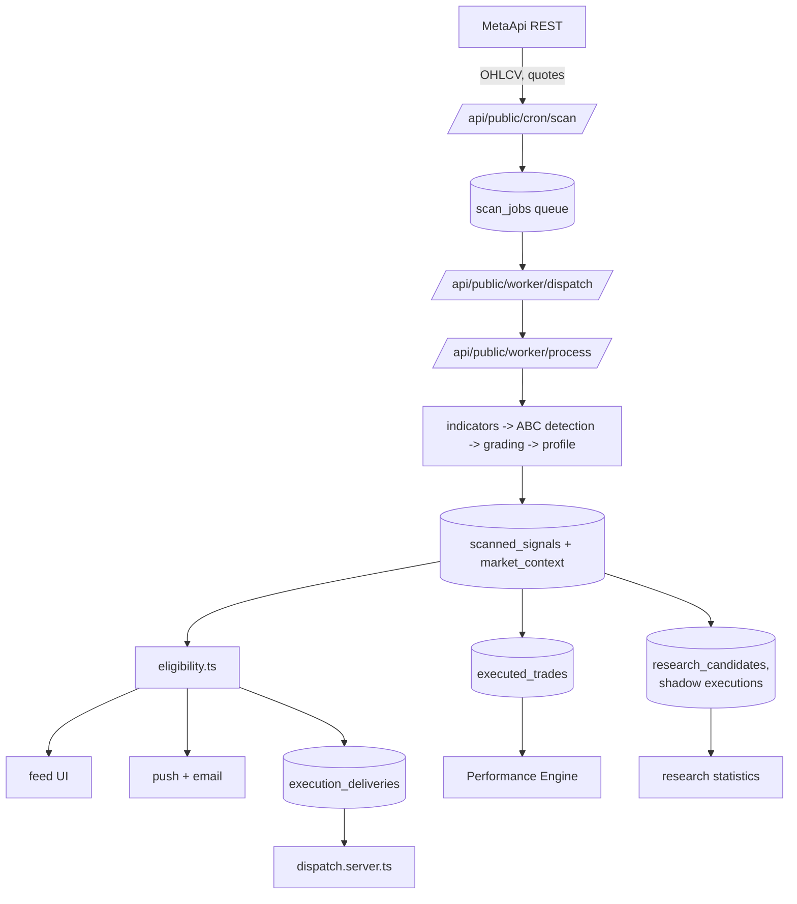

# Architecture

## Purpose

Describe the runtime planes, how data moves between them, and the isolation rules
that keep one plane from corrupting another.

## Current behaviour

### The four planes

| Plane | Owns | Must never |
| --- | --- | --- |
| Production signal generation | cron, queue, workers, scanner, `scanned_signals`, `market_context` | read the journal, research tables, or delivery state |
| Research / shadow | `research_candidates`, shadow executions, replay, regime and payoff stats | write to `scanned_signals` or change any published field |
| User analytics | `executed_trades`, canonical R, Performance Engine | mix R bases, or borrow research numbers as personal results |
| Execution delivery | `execution_deliveries`, controls, dispatch | influence publication, eligibility, enrolment or any statistic; interrupt a scan |

Isolation is enforced structurally: `src/lib/delivery/execution.ts` documents that
nothing importing it may be reachable from the scanner pipeline, and the research
tables are read through cohort-scoped views rather than the production tables.

### Stack

TanStack Start v1 on Vite 7, React 19, Tailwind v4, Supabase (Postgres + auth +
RLS) as the backend, deployed to an edge Worker runtime. Server logic is
`createServerFn` for in-app RPC and file routes under `src/routes/api/` for HTTP
endpoints. `/api/public/*` bypasses site auth and therefore authenticates its own
callers.

## Inputs

Broker candles and quotes; authenticated user requests; cron callers bearing the
cron secret; MCP tool calls bearing an OAuth bearer token.

## Outputs

Rendered terminal routes, JSON for MCP and API routes, queued deliveries, push
and email messages.

## Provenance

The plane a value came from is recorded with it — model version on signals,
author on journal price writes, cohort on research rows, config version on
deliveries.

## Failure behaviour

- A dead worker leaves jobs claimable again; a dead dispatcher leaves a `sent` or
  `unknown` delivery permanently unclaimable by design.
- Broker unavailability degrades to a skipped instrument, not a failed cycle.
- Server functions guarded by auth middleware throw 401 rather than returning
  partial data, so they are never called from public-route loaders.

## User-facing meaning

The terminal a user sees is one plane's output. "No signals" is the production
plane; "not enough evidence" is the statistics plane; "dry run" is the execution
plane. They are separate systems and can legitimately disagree.

## What this architecture does not guarantee

Exactly-once delivery to an external bridge, ordering between planes, or that a
research result generalises to live trading.

## Implementation

`src/routes/api/**`, `src/lib/scanner/pipeline.server.ts`,
`src/lib/delivery/*`, `src/lib/research/*`, `src/start.ts`, `src/server.ts`.

## Tests

`src/lib/delivery/__tests__/*`, `src/lib/execution/__tests__/*`,
`src/test/db/__tests__/*`.
